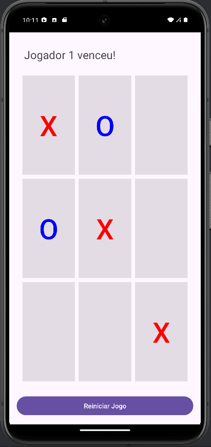

# Jogo da Velha (Tic-Tac-Toe)



## Descrição

Este é um simples jogo da velha (Tic-Tac-Toe) desenvolvido para Android. O jogo permite que dois jogadores alternem suas jogadas, escolhendo entre "X" e "O". O objetivo é alinhar três símbolos em uma linha, seja vertical, horizontal ou diagonal.

## Funcionalidades

- Jogo para dois jogadores
- Alternância automática entre os jogadores
- Verificação de vitória e empate
- Cores diferentes para "X" e "O"
- Desabilitação de células já preenchidas
- Reinício do jogo com um botão
- Destaque da linha vencedora com animações

## Tecnologias Utilizadas

- **Linguagem de Programação:** Kotlin
- **Plataforma:** Android
- **IDE:** Android Studio

## Instalação

1. Clone este repositório:
   ```bash
   git clone https://github.com/Vitaedoca/TicTacToe.git
